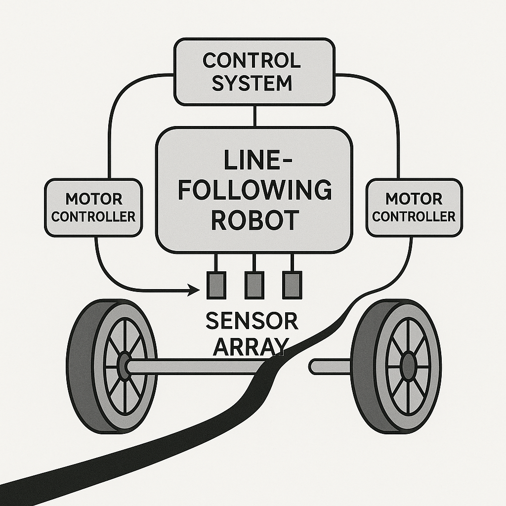

# Line-Following Robot Simulation in C++

This project simulates a simple line-following robot using C++. It models a robot with virtual infrared (IR) sensors, motor controllers, and different control strategies (Basic Logic and PID). The simulation is text-based and can be run from the terminal.



## 🔧 Features

- Modular simulation of IR sensor array and motor controllers
- Error computation from simulated sensor readings
- Two control strategies:
  - Basic if-else logic
  - PID control for smooth line tracking
- Command-line simulation output
- Well-structured with Doxygen documentation

## 📁 Project Structure

line_follower_simulation/
├── CMakeLists.txt
├── Doxyfile
├── include
│   ├── control_strategy.hpp
│   ├── motor_controller.hpp
│   ├── robot.hpp
│   └── sensor_array.hpp
├── README.md
└── src
    ├── control_strategy.cpp
    ├── main.cpp
    ├── motor_controller.cpp
    ├── robot.cpp
    └── sensor_array.cpp

## 🛠️ Build Instructions

### 🔧 Requirements:
- C++17 compatible compiler (e.g., `g++`, `clang++`)
- CMake 3.10+

### 📦 Build and Run:

```bash
# Clone the repo
git clone git@github.com:ahmedsheaira/line_follower_simulation.git
cd line_follower_simulation

# Build
mkdir build
cd build
cmake ..
make

# Run
./LineFollowerSimulation
```

### 📊 Sample Output

```text
Step 1:
[Motors] Left: 0.5, Right: 0.5
Step 2:
[Motors] Left: 0.5, Right: 0.5
Step 3:
[Motors] Left: 0.5, Right: 0.5
Step 4:
[Motors] Left: 0.6, Right: 0.4
Step 5:
[Motors] Left: 0.6, Right: 0.4
Step 6:
[Motors] Left: 0.6, Right: 0.4
Step 7:
[Motors] Left: 0.6, Right: 0.4
Step 8:
[Motors] Left: 0.6, Right: 0.4
Step 9:
[Motors] Left: 0.6, Right: 0.4
Step 10:
[Motors] Left: 0.6, Right: 0.4
Step 11:
[Motors] Left: 0.6, Right: 0.4
Step 12:
[Motors] Left: 0.6, Right: 0.4
Step 13:
[Motors] Left: 0.6, Right: 0.4
Step 14:
[Motors] Left: 0.6, Right: 0.4
Step 15:
[Motors] Left: 0.6, Right: 0.4
Step 16:
[Motors] Left: 0.6, Right: 0.4
Step 17:
[Motors] Left: 0.6, Right: 0.4
Step 18:
[Motors] Left: 0.6, Right: 0.4
Step 19:
[Motors] Left: 0.6, Right: 0.4
Step 20:
[Motors] Left: 0.6, Right: 0.4
...

### 📘 Documentation

```bash
doxygen Doxyfile
# Open docs/html/index.html in your browser
```
